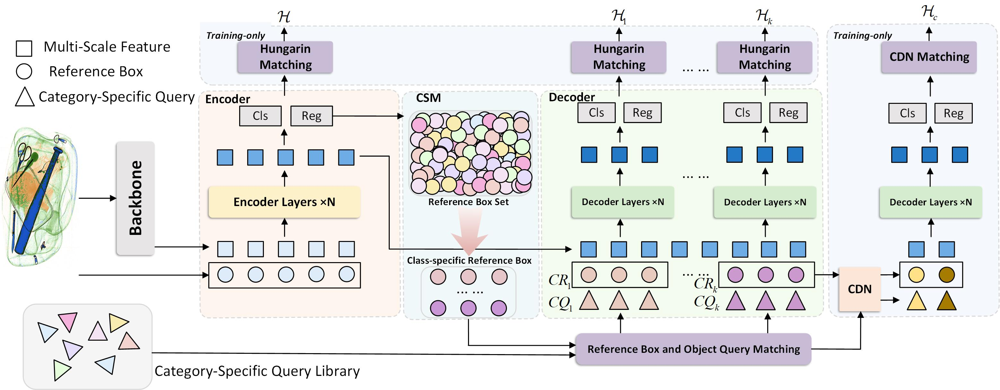

# **AO-DETR: Anti-Overlapping DETR for X-Ray Prohibited Items Detection**

[[Paper]](https://ieeexplore.ieee.org/document/10746383/)
[[TNNLS24]AO-DETR: 针对X射线图像违禁品检测的抗重叠DETR - 知乎](https://zhuanlan.zhihu.com/p/5403273899))

## Abstract

针对X-ray违禁品图像重叠现象严重的特点，我们提出了Anti-Overlapping DETR （AO-DETR）基于目前最先进的通用目标检测器之一DINO。具体而言，我们分析了重叠现象带来了两大问题，分别是前景背景特征的耦合以及违禁品边缘模糊。针对重叠现象带来的特征耦合问题，我们提出了CSA策略来束缚category-specific object queries预测固定类别的违禁品，进而提升其对重叠的前景背景特征中提取特定类别违禁品特征的能力。针对重叠现象带来的边缘模糊问题，我们提出LFD scheme，通过提升中高level的decoder层的reference boxes的定位准确程度来提升最终层对于模糊边缘的定位能力。经过大量的实验和可视化，我们验证了两种方法对于重叠现象带来的精度下降有修正作用。在统一实验条件下（比如12epoch，image size=320*320），AO-DETR在PIXray，OPIXray和HIXray三个违禁品检测数据集上都取得了SOTA结果。此外，我们还进行了无限制对比，不考虑实验的公平性来比较现有的所有违禁品检测器，同样取得了SOTA结果。

## User Guide

想要运行AO-DETR只需要运行tools/train_ao-detr.py

DINO和其他Deformable DETR-based variants可以参考train_ao-detr.py中的注释！

PIXray，OPIXray，HIXray数据集都可以运行，只需要更换config文件即可

## 🎉️🎉️🎉️Cite

**本工作的论文《### [AO-DETR: Anti-Overlapping DETR for X-Ray Prohibited Items Detection](https://ieeexplore.ieee.org/document/10746383/)》已经录用在TNNLS期刊上，目前处于Early Access状态！！！
如果我的工作对您有帮助的话，欢迎使用以下BibTex进行引用：**

```
@article{ WOS:001351423100001, 
Author = {Li, Mingyuan and Jia, Tong and Wang, Hao and Ma, Bowen and Lu, Hui and Lin, Shuyang and Cai, Da and Chen, Dongyue}, 
Title = {AO-DETR: Anti-Overlapping DETR for X-Ray Prohibited Items Detection}, Journal = {IEEE TRANSACTIONS ON NEURAL NETWORKS AND LEARNING SYSTEMS}, 
Year = {2024}, Month = {2024 NOV 6}, DOI = {10.1109/TNNLS.2024.3487833}, EarlyAccessDate = {NOV 2024}, ISSN = {2162-237X}, EISSN = {2162-2388},
}
```



<!-- 
🚀️ 🚀️ 🚀️ PIXray Dataset Download

**PIXray in COCO format 独家链接！！！**

由于原版PIXray数据集的格式并不规范，无法直接使用在主流代码库。因此，我整理了一份coco格式的PIXray数据集，可以通过连接下载[PIXray_coco](https://drive.google.com/drive/folders/1jkLaB1YVMaxDZ6Qv84ad5zHIXd80thAr?usp=sharing)
I have put together a copy of the PIXray dataset in coco format, which can be downloaded via connection[PIXray_coco](https://drive.google.com/drive/folders/1jkLaB1YVMaxDZ6Qv84ad5zHIXd80thAr?usp=sharing)

## **Requirements！**
-->

```python
python 3.9.17
pytorch 1.13.1
mmdet 3.1.0
mmcv 2.0.1
```

具体安装教程参见[mmdetection官网教程3.1.0版本](https://mmdetection.readthedocs.io/en/v3.1.0/get_started.html)
